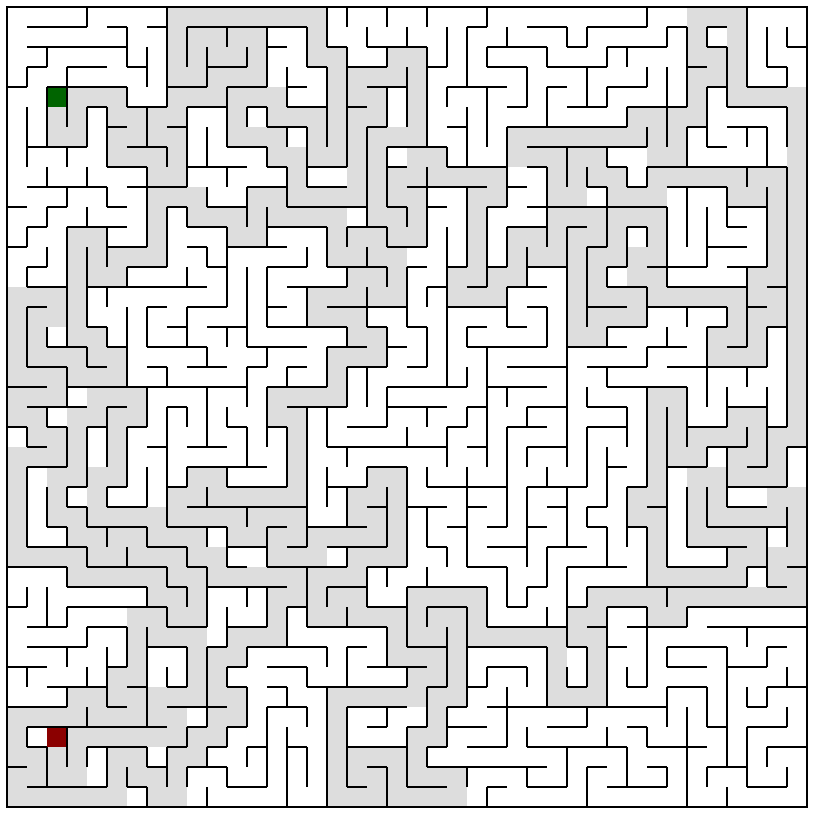

# Some maze experimentations :-)

Hi guys!

I've played a bit with mazes and tried to give a working answer to :

1. How to generate programmatically a maze ?
2. How to calculate the path between two points ?

Of course, there are different kind of mazes, and I believe better ways to create / manipulate them.  
This is only a working solution built from scratch, and for the fun :-)  

I've implemented that in Javascript and PHP, please see the result below.  
For both case, performances drop quickly when increasing the maze size, but up to 100x100 it's satisfying.
  
Any comment / improvement / suggestion / explanation is highly welcomed.

I've also build a very basic game using the Javascript implementation.  
You can give it a try here : [Escape The MAze](https://escape-the-maze.netlify.com/game/)

